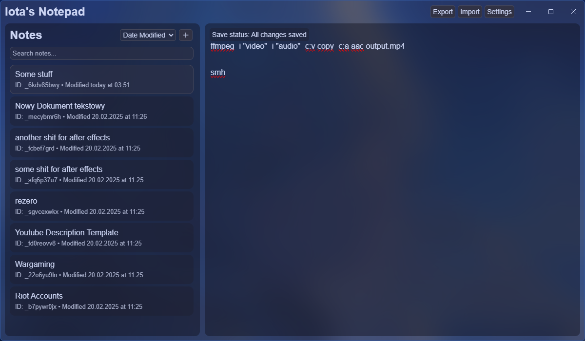
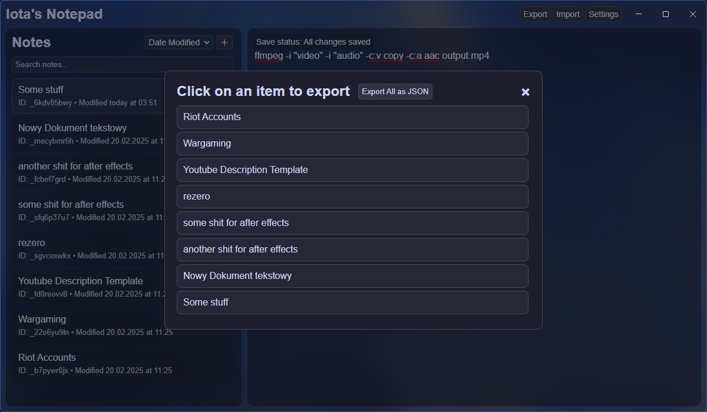

# Iota's Notepad - Mica

Iota's Notepad is a simple note-taking application built with Electron. It allows you to create, edit, and delete notes with a user-friendly interface.

## Features

- **Create new notes**: Easily create new notes for quick note-taking.
- **Edit existing notes**: Modify previously created notes with ease.
- **Delete notes**: Remove notes that are no longer needed.
- **Sort notes by**:
  - **Date created**: Organize notes by their creation date.
  - **Date modified**: Sort notes based on the last modification date.
  - **Alphabetical order**: Arrange notes alphabetically.
  - **Index**: Sort notes by a custom index value.
- **Export/Import notes**:
  - **Export all notes at once in a JSON format**: Save all notes into a JSON file for backup or sharing.
  - **Import notes**: Easily import notes from a JSON file.
- **Search notes**: Quickly search through all notes to find specific content.
- **Save notes automatically to local storage**: Notes are saved automatically without requiring manual intervention.
- **Save notes manually with `Ctrl+S` (or `Cmd+S` on macOS)**: Use the keyboard shortcut to manually save your notes.
- **In-app update notifications**: Stay informed when updates are available for the app.
- **Settings modal**: Access app settings for customizing functionality and preferences.
- **12-hour and 24-hour time formats**: Choose between 12-hour and 24-hour time format for note timestamps.
- **Selectable Catppuccin Mocha, Frappe, and Macchiato flavors**: Choose from three Catppuccin theme flavors for a personalized interface.
- **Import and apply custom themes**: Customize the UI colors by importing and applying your own themes.
- **Developer Options**: Access DevTools.


## Installation

1. Download the latest release from the [releases page](https://github.com/vorlie/iotas-notepad/releases/latest).
2. Run the setup file to install the application.
3. Follow the on-screen instructions to complete the installation.
4. The app will be installed under:
    - Windows: `C:\Users\USER\AppData\Local\iotas-notepad`

## Checking for Updates

Iota's Notepad automatically checks for updates when the application starts. If a new version is available, an in-app notification will inform you about the update, displaying the new version number and providing a download link for the setup file. You can dismiss the notification if you choose not to update immediately. You can also manually check for updates by clicking the "Check for Updates" button.

## Usage

- Click the "+" button to create a new note.
- Click on a note in the sidebar to edit it.
- Click the "Export" or "Import" to export/import notes.
    - "Export" button opens a modal and from there you can choose which note to export.
    - Inside the export modal there is a button "Export All as JSON", which will export all notes in a JSON format.
- Type in the search bar to search notes.
- Right-click on a note to open the context menu, where you can edit the title, delete the note, or save the note.
- Notes are saved automatically after 10 seconds of inactivity or when you press `Ctrl+S` (or `Cmd+S` on macOS).
- Sort notes using the dropdown menu in the sidebar by date created, date modified, alphabetical order, or index.
- **Import and apply custom themes**:
    - Click the "Import Theme" button in the settings modal to import a custom theme from a JSON file.
    - Select the imported theme from the "Theme Flavor" dropdown to apply it.
    - Click the "Delete Selected Theme" button to remove a custom theme.

## Adding Custom Themes

### Use the Theme Editor *(Optional)*
- Click the **"Open Theme Editor"** button to access a embedded editor for customizing themes.
- Alternatively, you can open the [theme editor website](https://vorlie.pages.dev/theme-editor) to modify and export themes easily.
- **Note:** The theme editor does not directly interact with the application. After creating a theme, you must manually import the exported JSON file.

### Importing Custom Themes
You can add custom themes to Iota's Notepad by importing a JSON file with the theme definitions.

1. **Create a JSON file** with your custom theme definitions. The JSON file should follow this structure:
    - Or just use the [theme editor website](https://vorlie.pages.dev/theme-editor) :D
    ```json
    {
        "customThemeName": {
            "--color-bg-dark": "#yourColor",
            "--color-bg-dark-alpha": "#yourColorWithAlpha",
            "--color-bg-darker": "#yourColor",
            "--color-bg-darker-alpha": "#yourColorWithAlpha",
            "--color-bg-medium": "#yourColor",
            "--color-bg-medium-alpha": "#yourColorWithAlpha",
            "--color-bg-light": "#yourColor",
            "--color-bg-light-alpha": "#yourColorWithAlpha",
            "--color-border": "#yourColor",
            "--color-text": "#yourColor",
            "--color-placeholder": "#yourColor",
            "--color-hover": "#yourColor",
            "--color-hover-light": "#yourColor",
            "--color-close-hover": "#yourColor",
            "--color-scrollbar-bg": "#yourColor",
            "--color-scrollbar-thumb": "#yourColor",
            "--color-scrollbar-thumb-hover": "#yourColor",
            "--color-button-download": "#yourColor",
            "--color-button-download-hover": "#yourColor",
            "--color-button-download-text": "#yourColor"
        }
    }
    ```
2. **Import the JSON file**:
    - Open the settings modal by clicking the "Settings" button.
    - Click the "Import theme" button and select your JSON file.
    - The custom theme will be added to the "Theme Flavor" dropdown.
3. **Apply the custom theme**:
    - Select the imported theme from the "Theme Flavor" dropdown.
    - Click the "Save settings" button to apply the theme.
4. **Delete a custom theme**:
    - Select the custom theme from the "Theme Flavor" dropdown.
    - Click the "Delete theme" button to remove the theme.
5. **Preview and Apply a Theme**:
    - Select a theme from the dropdown to preview it.
    - Save the settings to apply the chosen theme permanently.

## Screenshots

### Main Interface


### Export Modal


## Development

To set up the development environment:

1. Clone the repository:
    ```sh
    git clone https://github.com/vorlie/iotas-notepad.git
    ```
2. Navigate to the project directory:
    ```sh
    cd iotas-notepad
    ```
3. Install the dependencies:
    ```sh
    npm install
    ```
4. Run the app in development mode with live reloading:
    ```sh
    npm run electron
    ```

## Packaging

To package the app for distribution:
```sh
npm run package
```

## License

This project is licensed under the MIT [LICENSE](LICENSE).

## Contributing

Contributions are welcome! Please open an issue or submit a pull request.

## Acknowledgements

- [Electron](https://www.electronjs.org/)
- [Bootstrap Icons](https://icons.getbootstrap.com/)
